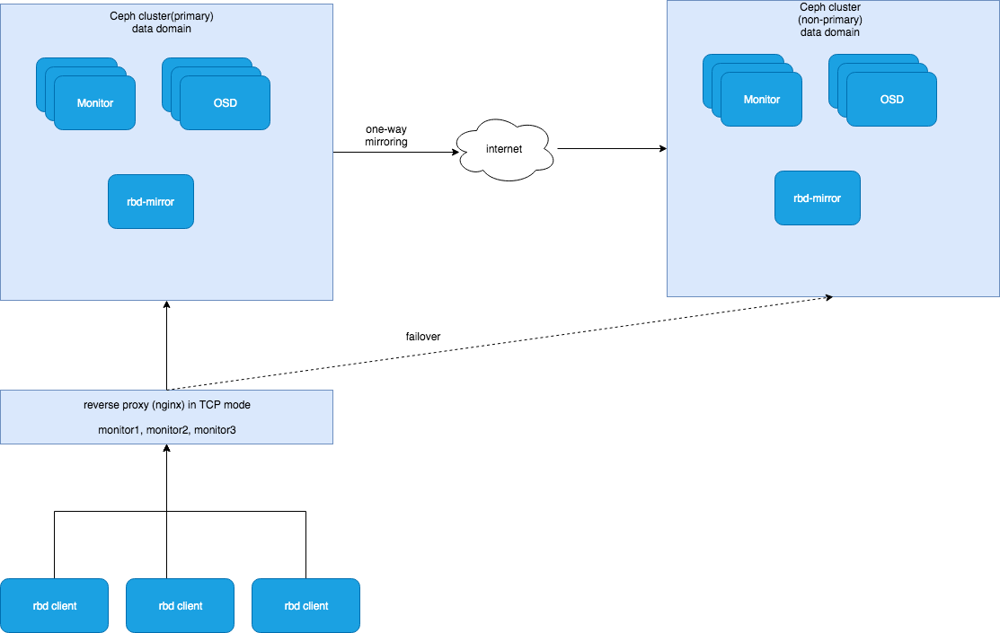

# Ceph Rbd Mirror 实施方案

## Ceph Rbd Mirror简介
关于rbd mirror的详细介绍请参照此[链接](https://github.com/hopkings2008/ceph-beginner/blob/master/rbd-mirror.md) 

## Ceph Rbd Mirror的使用方式 
ceph的rbd mirror目前只支持active-passive的方式，对于目前数据中心两地三中心的部署方式，如果主节点不可访问，只能线下把从节点切成主节点，同时所有的客户端需要改变ceph的访问地址，即改为切换后的新的主节点的地址。  

## 两地三中心的实施方案

  

当主数据中心不可访问时，为了简化客户端的配置，可以在数据中心和客户端之间建立一个反向代理。由于ceph的底层通信使用的tcp的模式，故此反向代理是基于tcp的模式。目前nginx支持tcp的反向代理。 

### Failover 
当主数据中心不可访问时，可以按照以下步骤进行数据中心的访问切换：  
1. 把从数据中心promote为主数据中心
2. 切换反向代理，所有后端的monitor的地址改为新的主数据中心中monitor的地址

### Failback
当之前的主数据中心恢复后，可以按照如下步骤切换回之前的主数据中心：  
1. demote当前的主数据中心
2. 在新恢复的数据中心里resync所有的image
3. promote新恢复的数据中心为主数据中心
4. 切换反向代理，将所有后端的monitor的指向改为新恢复的主数据中心中monitor的地址