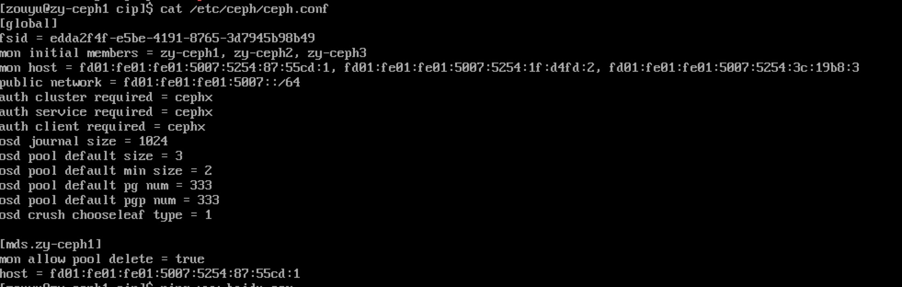
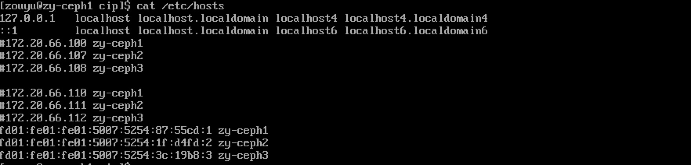
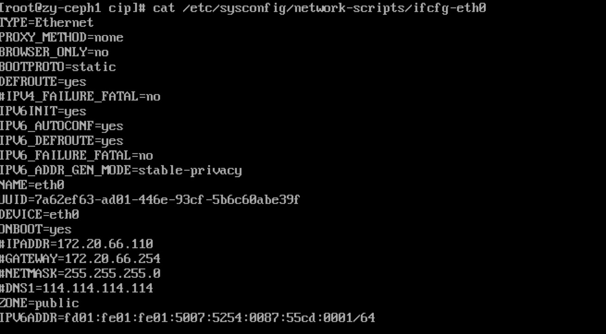

# Ceph集群从IPv4升级到IPv6

## 测试系统

### 测试OS
CentOS 7.6

### 使用的Ceph版本
v12.2.11

### 测试集群中的节点数
Ceph集群由3个节点组成，分别为zy-ceph1, zy-ceph2, zy-ceph3  
对应的IPv4地址分别为：172.20.66.110, 172.20.66.111和172.20.66.112  
升级后的IPv6的测试地址分别为：  
fd01:fe01:fe01:5007:5254:87:55cd:1  
fd01:fe01:fe01:5007:5254:1f:d4fd:2    
fd01:fe01:fe01:5007:5254:3c:19b8:3   

## 升级方案
由IPv4升级到IPv6可以看作是换ip地址的过程，由于Ceph的集群由monitor，osd，mgr，和mds组成，
其中monitor的ip地址是存储在kv里的，其他组件都是通过ceph.conf进行存储的。因此，修改ip地址，可以看作是替换monitor中kv里的ip和ceph.conf里的ip。ceph.conf里的ip地址非常容易替换，下面主要介绍monitor的ip地址替换。  
***具体步骤如下***：  
1. monitor中的ip地址替换
2. ceph.conf 中的ip地址的替换
3. /etc/hosts中每个集群节点的地址替换
4. 启动节点中的ceph组件

### monitor的ip地址替换
参见Ceph官网中换[ip地址的文档](http://docs.ceph.com/docs/mimic/rados/operations/add-or-rm-mons/#changing-a-monitor-s-ip-address)
具体步骤如下：

1. 获取monmap
   
	```
	ceph mon getmap -o backup/monmap
	```
	
2. 打印monmap中的cluter地址  
 
   ```
   monmaptool --print backup/monmap
   ```
   
   可以看出原始的3个IPv4的地址
3. 删除原有的IPv4的地址

	```
	monmaptool --rm zy-ceph1 --rm zy-ceph2 --rm zy-ceph3 backup/monmap
	```
	
4. 设置新的IPv6的地址

   ```
   monmaptool --add zy-ceph1 [fd01:fe01:fe01:5007:5254:87:55cd:1]:6789 --add zy-ceph2 [fd01:fe01:fe01:5007:5254:1f:d4fd:2]:6789 --add zy-ceph3 [fd01:fe01:fe01:5007:5254:3c:19b8:3]:6789 backup/monmap
   ```
5. 停止运行中的所有ceph组件  
6. 将新的monmap应用到monitor集群中  
 
	```
	ceph-mon -i zy-ceph1 --inject-monmap backup/monmap
	```

### ceph.conf中ip地址的替换
ceph.conf中的IPv6的地址设置如下：  
 
***将更新后的ceph.conf文件同步到其他节点上***

```
ceph-deploy --overwrite-conf push zy-ceph1 zy-ceph2 zy-ceph3
```

### /etc/hosts文件中节点IPv6的设置
/etc/hosts中新的IPv6的地址设置如下：


### 启动ceph集群中的组件
例如启动monitor 组件:
  
```
systemctl start ceph-mon@zy-ceph1
```

***在其他两个节点（zy-ceph2, zy-ceph3）上执行如上操作***  
  
## IPv6的地址设置  
### 通过命令设置  

```
ip -6 addr add 2001:0db8:0:f101::1/64 dev eth0
```

### 通过配置文件设置  
配置文件 /etc/sysconfig/network-scriptes/ifcfg-eth0  
  

### 检查ip地址是否正常工作  

```
ping6 2001:0db8:0:f101::1
```

## 对象存储的Ipv6部署
对象存储的部署，可以参照[yig](https://github.com/journeymidnight/yig)

### tidb的IPv6部署
请参考tidb的[Ansible离线部署](https://pingcap.com/docs-cn/)。

* 修改host.ini文件，设置ipv6的地址
* 修改start.yml文件，将http的url里加上'[]'
* inventory.ini文件，设置ipv6的地址

### yig的部署
修改yig的配置文件，将相关地址都换成ipv6的地址，并且用'[]'括起来

### nginx的部署
安装openresty-1.13.6.2，参考此[链接](https://openresty.org/cn/linux-packages.html#centos)。  
配置nginx.conf文件((/usr/local/openresty/nginx/conf/nginx.conf)：

```
upstream yig {
       server [fd01:fe01:fe01:5007:5254:87:55cd:1]:8080 weight=1;
       server [fd01:fe01:fe01:5007:5254:1f:d4fd:2]:8080 weight=1;
   }
   
listen [::]:80;

```  

### keepalived的部署
配置如下：

```
在global_defs里，启用：vrrp_mcast_group6 ff02::12
virtual_ipaddress的设置如下：

virtual_ipaddress {
   fd01:fe01:fe01:5007:5254:1f:d5fe:4/64
}

```

### 使用s3cmd验证对象存储
设置步骤如下：

```
1. 设置本机的/etc/hosts文件，设置ipv6的域名，比如：'fd01:fe01:fe01:5007:5254:1f:d5fe:4 yig6.com'，注意此域名必须在yig的配置文件里同样设置上
2. 设置本机.s3cfg文件，设置好对应的host及ak／sk.
3. 使用s3cmd验证所部署的基于ipv6的对象存储
```