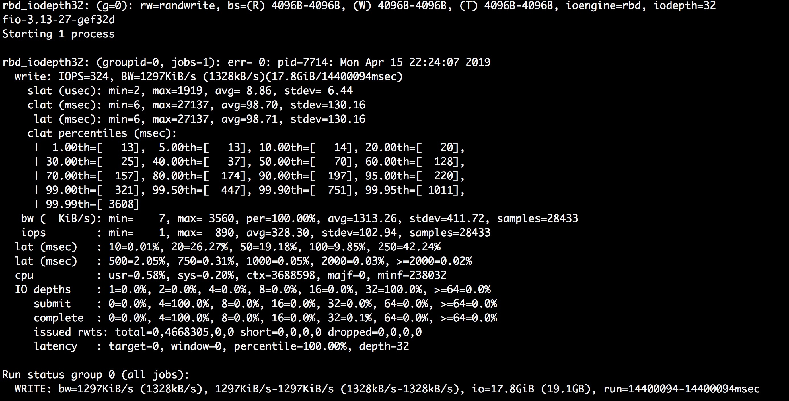

# RBD Mirror
## 背景
Ceph 本身是一个高可用的存储集群，使用CRUSH进行数据分片，把数据均匀分布到多个OSD上。目前为了满足数据中心的高可用，数据中心一般都采用两地三中心的形式，即同城部署生产数据中心和灾备中心，异地部署异地灾备中心。Ceph的RBD Mirror 正是为了实现异地灾备中心而诞生的。  

## RBD Mirror介绍
Ceph的块存储（RBD）在跨区域数据中心的同步上一直是个短板。由于Ceph底层的对象存储其写操作是个强一致性，即对于client的一个写请求，对应的写操作在所有的osd上同步写完后才返回给client，这种操作方式对于跨区域的同步方式是非常不合适的，因为网络延迟在跨区域的场景里会比较高，这会造成一个client的写请求需要等较长的时间才能收到响应。这种方式会大大的降低IOPS。为了解决这个问题，Ceph的RBD Mirror使用异步的方式把primary的镜像同步到non-primary集群中。Ceph增加了rbd-mirror这个daemon来进行镜像的数据同步。

## RBD Mirror的使用模式
Ceph RBD Mirror支持两种使用模式：  

### 单向模式
镜像数据只能从primary的集群同步到non-primary的集群里，rbd-mirror的daemon只运行在non-primary的集群里即可。一个primary集群可以由多个non-primary集群进行备份

### 双向模式
镜像数据可以从primary的集群里同步到non-primary的集群里，也可以反向同步。使用此种模式，primary集群和non-primary集群都需要运行rbd-mirror。

## RBD Mirror同步数据源的选择

### 基于整个Pool的同步
如果选择了pool同步的方式，Ceph集群里pool中所有启用journal的image都会被自动同步  

### 基于某个Image的同步
只选择某个Image的同步，此Image必须启用journal  

## 实现机制
Ceph RBD Mirror利用RBD Image的journal特性，从primary集群中把journal同步到non-primary集群里，然后进行replay，把journal中记录的变更数据存到non-primary的集群里。journal是为了实现consistency的一种机制。有很多实现consistency的方式，比如log，Ceph选择使用journal的方式，是因为其相对log来说比较轻量且更加易于实现。Ceph 增加了rbd-mirror这个守护进程来进行journal的同步。  
如果某个镜像启用了journal，librbd的每次写操作都会先写到journal后，然后返回给调用者。随后journal中的数据会被刷新到osd的磁盘中。   
non-primary的集群中的rbd-mirror会每隔5s同步一下primary集群中的journal数据，然后在本地replay，这样就把primary中的image异步的同步到了本地集群中。


### RBD Image Journal
RBD Image的journal存储了Image的更新操作及数据。journal也是作为对象存储到Pool中，默认和Image是在同一个pool里。每个image的更新操作被抽象为一个Event，每个Event会被append到对应的journal里。目前v12.2.11版本对每个image创建了一个journal。  

#### JournalMetadata
RBD Image 会给每个journal创建一个JournalMetadata，journal的metadata里会记录每个已提交的EventEntry，以ObjectPosition的形式记录到metadata里。Journal的metadata也是写到osd的object里。  
ObjectPosition里会记录如下内容：  

* object_number
* tag_tid
* entry_tid

tag_tid： rbd会给journal中每个EventEntry分配一个tag_tid，以单调增加的方式付值。  
entry_tid： 和tag_tid相关联的值，以单调增加的方式付值。  
object_number： EventEntry会记录在osd中的对象中，这个对象有个
标识，其计算规则为:  

```
object_number = splay_offset + active_set * splay_width
splay_offset = entry_tid % splay_width
```

rbd相当于给journal中的所属对象分成了一个个的组，每个组用active_set来标识，splay_width代表每个组里有多少个对象。  
由于journal中的每个event是以append的方式记录到object里了，当一个组里的所有object都被写满的时候，就会增加active_set的值，从而分配一个新的组。 
从上面的公式可以看出splay_offset一定会小于splay_width，所以如果根据object_num来计算active_set的话，则计算公式如下：
 
```
active_set = object_num / splay_width 
```

***journal总是以append的方式记录每个event，对于rbd中image分散在多个object中的数据，在数据没有超过journal中object size的前提下，都会被记录在同一个object中，这种方式也决定了写journal会比较慢***

#### Journal中的EventEntry
RBD Image journal中的记录的每个数据被封装成EventEntry，其中记录了如下内容:  

 * offset：每个EventEntry的偏移量
 * event_length: 每个EventEntry中数据的长度
 * event_bufferlist：每个EventEntry中记录的数据

#### librbd写镜像的流程 


Image中的数据会首先写入到journal的pool中，然后给调用者返回ack，此时会触发回调操作，会调用C_IOEventSafe，其finish回调函数会触发ObjectWriteRequest::send方法把journal中记录的变更数据存储到数据pool中，至此，一个Image的write请求会真正的处理完毕，数据也会写到对应的Image里。  
如上所有的Image的写操作都是在集成librbd的客户端的进程里完成的。journal的处理逻辑，就相当于在之前的image的写操作里加了一步，先写journal，再刷数据。  

#### journal replay的处理流程
non-primary的集群中使用rbd-mirror来监控primary集群中journal的变化，从而sync primary中journal的数据到本地，然后执行replay操作，将journal中记录的image的变更应用到本地。  
如果primary的pool中之前某个镜像已经存在，后来才enable了journaling这个feature，则non-primary的rbd-mirror会先sync这个image，然后再同步journal进行journal replay。每当primary中journal 的数据被同步完成后，被同步的journal所占用的object会被释放掉。  

### rbd-mirror daemon
rbd-mirror这个后台守护程序负责监控primary集群中journal的变化，负责同步journal中的数据。Ceph采用类似观察者模式来监控journal中的数据变化，在实现上有很多“Watcher”对象还有对应的“listener”对象。每当watcher探测到journal的变化，rbd-mirror就会同步journal，然后在本地执行replay，从而把image同步到本地。

## RBD Mirror Delayed Deletion
如果删除primary上的image的时候，会将备份节点上的image也删除，这样的话，如果误删除了primary上的image，会导致该image永远丢失了。因此需要设置delay delete ，这样可以将意外删除的image在设置时间内进行回收。  

## RBD Mirror Image恢复机制
目前RBD Mirror只支持active-passive的方式，不支持active-active的方式。镜像的恢复都是线下执行，而非线上同步执行。  
如果主节点挂掉，需要手工把从节点promote成主节点，而且所有的客户端都要换成对新的主节点的访问。当主节点恢复后，需要手工把之前的主节点demote成从节点，才能正常服务。 

## RBD Mirror 性能衰减对比
由于rbd mirror使用了journal进行主备的数据同步，基于journal的事件记录方式，主集群中数据的写入速度会衰减。根据测试，IOPS和每秒的写入有接近一半的衰减。
  
### 测试机器的配置

```
Model: PowerEdge R720
CPU: Intel(R) Xeon(R) CPU E5-2620 v2 @ 2.10GHz  
Memory: 96G
HDD: 580G, SAS, 数量：2
SSD: 450G, SSD, 数量：3
```
### 测试步骤 

```
使用上述配置的两台物理机器，其中一台做primary节点，另外一台做non-primary节点。数据都写入到HDD的一块数据盘上。
1. 使用默认的journal配置，使用fio工具在主节点进行image的写入，使用randwrite的方式，每次写入4k的数据。
2. 创建单独的ssd组成的pool，并把journal放入这个ssd组成的pool中
```

### 测试结果及性能对比

#### 未使用mirror的image的写测试


#### 启用mirror并使用默认配置的image的写测试


根据以上两个测试，启用mirror的前提下，image的写效率要比不启用mirror的情况下衰减一半

#### 启用mirror但是journal单独放在ssd组成的pool中


根据以上测试，在启用mirror的前提下，如果把journal的数据放在单独一个由ssd组成的pool中，则image的写效率可以有显著的提升。

## RBD Mirror 性能优化方式

### 使用ssd组成的pool存放journal中的数据
rbd默认使用存放data的pool来存放journal。由于journal的写是append的方式，分散在多个object中的数据有可能会被append到同一个object中，所以journal记录event不是同时分散在多个object中并发写的，因而比较慢。如果把存放journal的pool放在ssd组成的单独的pool中，会提高写的速度。primary pool和non-primary pool都需要使用ssd组成的pool来存放journal对象。

primary和non-primary集群中都需要使用ssd组成的pool来存放journal对象。***由于环境受限，本文中的测试只在primary集群中使用了ssd组成的pool来存放journal数据***。

### 存放journal的pool使能EC模式
由于journal中记录的event会在non-primary同步完成后删除，所以journal中记录的每个event都是临时数据。可以启用EC来减少存储journal的object所占用的空间

### 增加journal active set的元素个数，增加存储journal的object size
journal active set中的元素个数由参数splay_width指定。对象的size由object_size指定。设置的方式有两种：  

* 创建image的时候通过参数指定

```
--journal-splay-width
--journal-object-size
```

* 通过/etc/ceph/ceph.conf配置文件指定

```
rbd_journal_splay_width
rbd_journal_order
```

## RBD Mirror的部署方式
具体部署步骤参见[此文档](https://access.redhat.com/documentation/en-us/red_hat_ceph_storage/3/html/block_device_guide/block_device_mirroring
)

## 附录
1. [rbd mirror design draft](https://www.spinics.net/lists/ceph-devel/msg24169.html)  
2. [ceph rbd mirroring](http://docs.ceph.com/docs/master/rbd/rbd-mirroring/)  