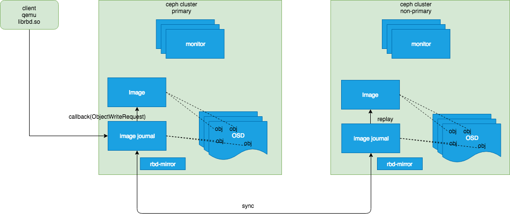

# RBD Mirror
## 背景
Ceph 本身是一个高可用的存储集群，使用CRUSH进行数据分片，把数据均匀分布到多个OSD上。目前为了满足数据中心的高可用，数据中心都采用两地三中心的形式，即同城部署生产数据中心和灾备中心，异地部署异地灾备中心。Ceph的RBD Mirror 正是为了实现异地灾备中心而诞生的。  

## RBD Mirror介绍
Ceph的块存储（RBD）在跨区域数据中心的同步上一直是个短板。由于Ceph底层的对象存储其写操作是个强一致性，即对于client的一个写请求，对应的写操作在所有的osd上同步写完后才返回给client，这种操作方式对于跨区域的同步方式是非常不合适的，因为网络延迟在跨区域的场景里会比较高，这会造成一个client的写请求需要等较长的时间才能收到响应。这种方式会大大的降低IOPS。为了解决这个问题，Ceph的RBD Mirror使用异步的方式把primary的镜像同步到non-primary这一端。Ceph增加了rbd-mirror这个daemon来进行镜像的数据同步。

## RBD Mirror的使用模式
Ceph RBD Mirror支持两种使用模式：  

### 单向模式
镜像数据只能从primary的集群同步到non-primary的集群里，rbd-mirror的daemon只运行在non-primary的集群里即可。

### 双向模式
镜像数据可以从primary的集群里同步到non-primary的集群里，也可以反向同步。使用此种模式，primary集群和non-primary集群都需要运行rbd-mirror。

### 备注
一个primary集群可以由多个non-primary集群进行备份

## RBD Mirror同步数据源的选择

### 基于整个Pool的同步
如果选择了pool同步的方式，Ceph集群里pool中所有启用journal的image都会被自动同步  

### 基于某个Image的同步
只选择某个Image的同步，此Image必须启用journal  

## 实现机制
Ceph RBD Mirror利用RBD Image的journal特性，从primary集群中把journal同步到non-primary集群里，然后进行replay，把journal中记录的变更数据存到non-primary的集群里。journal是为了实现crash-consistency的一种机制。有很多实现crash-consistency的方式，比如log，Ceph选择使用journal的方式，是因为其相对log来说比较轻量且更加易于实现。Ceph 增加了rbd-mirror这个守护进程来进行数据的同步。  
如果某个镜像启用了journal，librbd的每次写操作都会先写到journal后，然后返回给调用者。随后journal中的数据会被刷新到osd的磁盘中。   
non-primary的集群中的rbd-mirror会每隔5s同步一下primary集群中的journal数据，然后在本地replay，这样就把primary中的image同步到了本地集群中。

### RBD Image Journal
RBD Image的journal存储了Image的更新操作及数据。journal也是作为对象存储到Pool中，默认和Image是在同一个pool里。每个image的更新操作被抽象为一个Event，每个Event会被append到对应的journal里。目前v12.2.11版本对每个image创建了一个journal。如下是利用librbd进行写操作的一次流程:  

